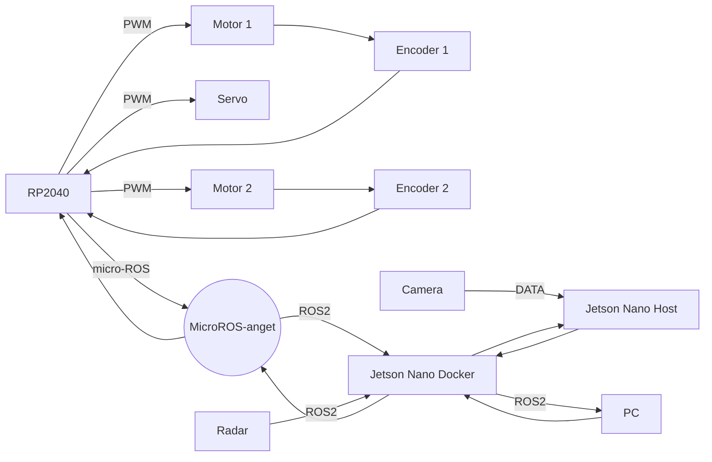

#

ros2 pkg create  w0x7ce_cartographer

mkdir config 

vim *lua

mkdir launch

vim *.launch.py

#  Prepare

```bash
sudo apt install ros-humble-cartographer
sudo apt install ros-humble-cartographer-ros
ros2 pkg list | grep cartographer
```

```bash
source /opt/ros/humble/setup.bash

```bash
git clone -b cool https://github.com/tianrking/w0x7ce_bot w0x7ce_bot
cd w0x7ce_bot
colcon build # colcon build --packages-select w0x7ce_cartographer 
source install/setup.bash
```

# Cartographer

```bash
ros2 launch sllidar_ros2 sllidar_launch.py
```

```bash
ros2 launch w0x7ce_cartographer cartographer.launch.py
```

```bash
ros2 run rviz2 rviz2
```

# save map

```bash
sudo apt install ros-humble-nav2-map-server
```

```bash
cd src/w0x7ce_cartographer/ && mkdir map && cd map
ros2 run nav2_map_server map_saver_cli -t map -f w0x7ce_map
```

# nav2

ros2 launch nav2_map_server map_saver_server.launch.py yaml_filename:=/home/w0x7ce/Desktop/w0x7ce_bot/map/w0x7ce_map.yaml 

ros2 launch nav2_bringup localization_launch.py map:=/home/w0x7ce/Desktop/w0x7ce_bot/map/w0x7ce_map.yaml

ros2 launch nav2_bringup navigation_launch.py map:=/home/w0x7ce/Desktop/w0x7ce_bot/map/w0x7ce_map.yaml use_sim_time:=false

ros2 launch slam_toolbox online_sync_launch.py

ros2 launch my_robot_launch.py


# debug

ros2 action send_goal /navigate_to_pose nav2_msgs/action/NavigateToPose "pose: { header: { frame_id: 'map' }, pose: { position: { x: 1, y: 1, z: 0.0 }, orientation: { x: 0.0, y: 0.0, z: 0.0, w: 1.0 }}}"

ros2 topic echo /cmd_vel

## Stuct




